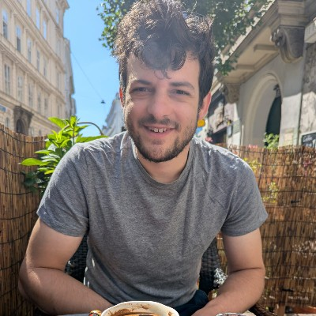

  

  **Kwinten De Backer** | Backend & DevOps Engineer | Master of Science in Physics and Astronomy (UGent)

  [kwinten.debacker@hotmail.com](mailto:kwinten.debacker@hotmail.com) • [LinkedIn](https://www.linkedin.com/in/%F0%9F%91%A8%F0%9F%8F%BC%E2%80%8D%F0%9F%94%A7-kwinten-de-backer-5087b5195/) • [GitHub](https://github.com/kiwiidb) • [kwintendebacker.com](https://kwintendebacker.com)

  Ghent, Belgium • +32473517977

---
## Summary

Experienced Backend and DevOps Engineer specializing in **Go** (scalable server-side applications) and **Kubernetes** infrastructure. Proficient in mobile development using **Flutter** (Google's cross-platform UI framework). Strong background in cloud infrastructure (GCP, Azure, AWS), infrastructure-as-code, and microservices architecture.

---

## Core Competencies

**Backend Development:** Go, Java (Spring Boot), Python, PostgreSQL
**DevOps & Infrastructure:** Kubernetes, Terraform, Docker, Helm, CI/CD Pipelines
**Mobile Development:** Flutter (cross-platform mobile apps for iOS/Android)
**Cloud Platforms:** Google Cloud, Azure, AWS, Digital Ocean
**Monitoring & Observability:** Prometheus stack, Apache Superset

---
## Personal Projects

**[Plowshare](https://plowshare.social)** — A platform for sharing Magic the Gathering games

**[Helm Charts](https://github.com/kiwiidb/helm-charts)** — Open-source Kubernetes deployments

---
## Experience

**Backend Engineer** | [Battmobiel](https://battmobility.be) | *Apr 2024 - Sep 2025*
• Develop backend services using **Go** (efficient, concurrent programming language) and Java Spring Boot
• Build cross-platform mobile applications with **Flutter** (single codebase for iOS & Android)
• Design and implement scalable microservices architecture for mobility solutions

**DevOps Engineer** | [Nexuzhealth](https://www.nexuzhealth.com/nl/) | *Dec 2023 - Apr 2024*
• Managed Kubernetes clusters and infrastructure automation using Terraform on Google Cloud
• Implemented CI/CD pipelines for healthcare platform deployments

**Infrastructure Engineer** | [Alby](https://getalby.com) | *Dec 2021 - Dec 2023*
• Architected and maintained Kubernetes infrastructure for Lightning Network services
• Developed [lndhub.go](https://github.com/getalby/lndhub.go), a Go-based Lightning wallet backend
• Co-created [Nostr Wallet Connect](https://nwc.dev/), an encrypted payment protocol

**Founder** | Flitz | *Apr 2021 - Nov 2021*
• Built Lightning-native Bitcoin DCA platform with Go backend and Flutter mobile app
• Deployed services on Kubernetes with C-Lightning integration

**Infrastructure Engineer** | [Strike](https://strike.me) | *Aug 2021 - Oct 2021*
• Managed enterprise Lightning node infrastructure on GCP using Kubernetes and Terraform

**DevOps/Backend Engineer** | [Battmobiel](https://battmobility.be) / [Sofico](https://sofico.be) | *Jan 2020 - Mar 2021*
• Built Azure Kubernetes Service (AKS) infrastructure and CI/CD pipelines
• Developed Spring Boot microservices using Java and Quarkus framework

**DevOps/Backend Engineer** | [Be-Mobile](https://be-mobile.com) | *Apr 2018 - Sep 2019*
• Automated deployments using Kubernetes, Jenkins, and Helm
• Developed Go services for GPS data processing and map visualization

**Deep Learning Engineer** | [Robovision](https://robovision.ai) | *Sep 2017 - Feb 2018*
• Built deep learning systems for industrial computer vision applications
